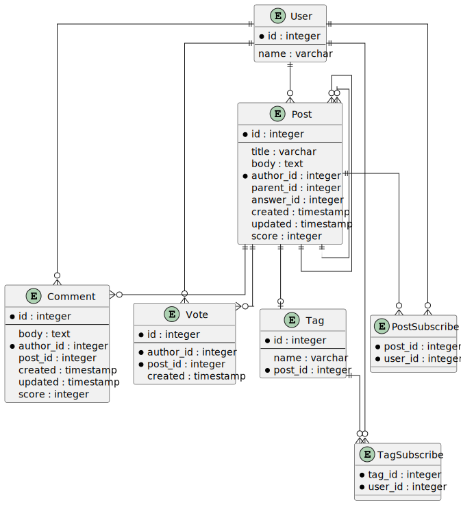

## User (Пользователь)
* id - идентификатор пользователя
* name - имя пользователя

## Post (Пост)
* id - идентификатор поста
* title - заголовок
* body - текст поста
* author_id - идентификатор автора
* parent_id - идентификатор вопроса (если есть)
* answer_id — идентификатор принятого ответа (если есть)
* created - дата и время создания
* updated - дата и время обновления
* score - рейтинг

## Коммент (Комментарий)
* id - идентификатор комментария
* body - текст комментария
* author_id - идентификатор автора
* post_id — идентификатор поста
* created - дата и время создания
* updated - дата и время обновления
* score - рейтинг

## Vote (Голос)
* id - идентификатор голоса
* author_id - идентификатор автора
* post_id — идентификатор поста
* created - дата и время создания

## Tag (тег)
* id - идентификатор тега
* name - заголовок
* post_id — идентификатор поста с кратким описанием тега

## Post Subscribe (Подписка на пост)
* post_id - идентификатор поста
* user_id - идентификатор пользователя

## Tag Subscribe (Подписка на тег)
* tag_id - идентификатор тега
* user_id - идентификатор пользователя

## ER-диаграмма

<figure markdown="span">
	{align=center}
  <figcaption>ER диаграмма</figcaption>
</figure>