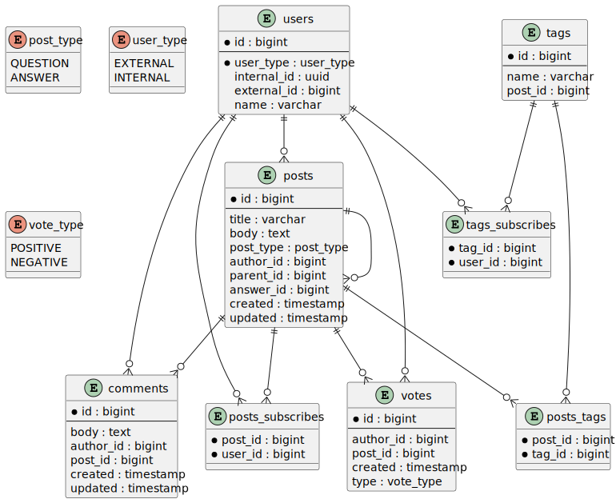

## User (Пользователь)

- **id** - идентификатор пользователя (IDENTITY)
- **user_type** - тип пользователя (EXTERNAL, INTERNAL) - enum
- **internal_id** - внутренний идентификатор (uuid)
- **external_id** - внешний идентификатор
- **name** - имя пользователя

**Связи:**

- Один ко многим с Post (как автор)
- Один ко многим с Comment (как автор)
- Один ко многим с Vote (как автор)
- Один ко многим с PostSubscribe
- Один ко многим с TagSubscribe

---

## Post (Пост)

- **id** - идентификатор поста (IDENTITY)
- **title** - заголовок поста
- **body** - текст поста
- **post_type** - тип поста (QUESTION, ANSWER) - enum
- **author_id** - идентификатор автора (внешний ключ)
- **parent_id** - идентификатор родительского поста (внешний ключ)
- **answer_id** - идентификатор принятого ответа (внешний ключ)
- **created** - дата и время создания
- **updated** - дата и время обновления

**Связи:**

- Многие к одному с User (автор)
- Многие к одному с Post (родительский пост)
- Многие к одному с Post (принятый ответ)
- Один ко многим с Comment
- Один ко многим с Vote
- Один ко многим с PostTag (связь с тегами)
- Один ко многим с PostSubscribe

---

## Comment (Комментарий)

- **id** - идентификатор комментария (IDENTITY)
- **body** - текст комментария
- **author_id** - идентификатор автора (внешнийкий ключ)
- **post_id** - идентификатор поста (внешний ключ)
- **created** - дата и время создания
- **updated** - дата и время обновления

**Связи:**

- Многие к одному с User (автор)
- Многие к одному с Post

---

## Vote (Голос)

- **id** - идентификатор голоса (IDENTITY)
- **author_id** - идентификатор автора (внешний ключ)
- **post_id** - идентификатор поста (внешний ключ)
- **created** - дата и время создания
- **type** - тип голоса (POSITIVE, NEGATIVE) - enum

**Связи:**

- Многие к одному с User (автор)
- Многие к одному с Post

---

## Tag (Тег)

- **id** - идентификатор тега (IDENTITY)
- **name** - название тега

**Связи:**

- Один ко многим с PostTag (связь с постами)
- Один ко многим с TagSubscribe

---

## PostTag (Связь поста и тега)

Составной ключ:

- **post_id** - идентификатор поста (внешний ключ)
- **tag_id** - идентификатор тега (внешний ключ)

**Связи:**

- Многие к одному с Post
- Многие к одному с Tag

---

## PostSubscribe (Подписка на пост)

Составной ключ:

- **post_id** - идентификатор поста (внешний ключ)
- **user_id** - идентификатор пользователя (внешний ключ)

**Связи:**

- Многие к одному с Post
- Многие к одному с User

---

## TagSubscribe (Подписка на тег)

Составной ключ:

- **tag_id** - идентификатор тега (внешний ключ)
- **user_id** - идентификатор пользователя (внешний ключ)

**Связи:**

- Многие к одному с Tag
- Многие к одному с User

---

## Типы данных

### PostType (Тип поста)

- **QUESTION** - вопрос
- **ANSWER** - ответ

### VoteType (Тип голоса)

- **POSITIVE** - положительный голос
- **NEGATIVE** - отрицательный голос

### UserType (Тип пользователя)

- **EXTERNAL** - внешний пользователь
- **INTERNAL** - внутренний пользователь

<figure markdown="span">
	{align=center}
  <figcaption>ER диаграмма</figcaption>
</figure>
